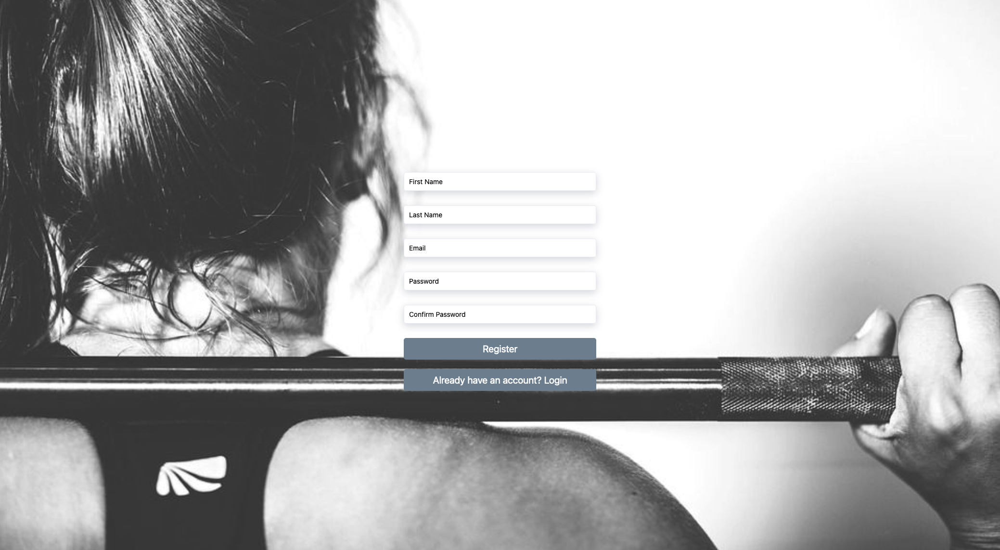
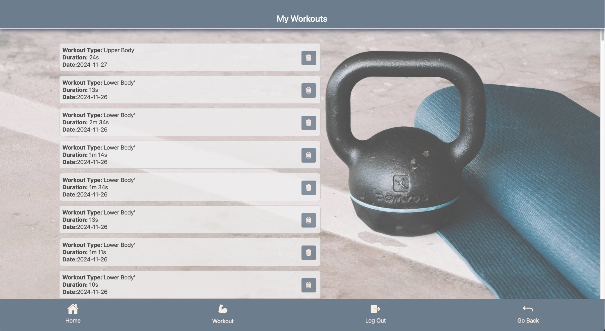

# My Workout App

## Overview

My Workout App is a comprehensive fitness tracking and workout management application designed to cater to both fitness enthusiasts and professionals. It includes user authentication, workout progress tracking, and customized exercise plans. The app supports lower and upper-body workout routines, real-time timers, and rest breaks, ensuring a streamlined and engaging fitness experience.

## Features

### Core Features

- **User Authentication:** Secure login and registration using Firebase Authentication.
- **Workout Management:**
  - Select between upper-body and lower-body workout routines.
  - Track time, sets, and repetitions for each session.
  - Display progress with real-time updates.
- **Timers:** Real-time countdown timers for rest and activity periods.
- Flash and vibrate indicators for when the rest time ends.
- Workout timer keeping track of the whole workout session.
- Inactivity timers keeping track of the users activity and safely ending a workout and saving the data when the timers run out.
- **Progress Tracking:**
- View completed workouts with detailed session logs.
- Visual feedback on workout duration and type.
- **Responsive Design:** Optimized for both mobile and web with React Native.
- **Cloud-based Backend:** Powered by Firebase and Google Cloud for secure and scalable data management.

### Additional Features

- **WorkoutContext:** Persistent state management for workout sessions.
- **Cloud Integration:** Data securely stored and synced via Firebase Firestore.
- **Dynamic Menus:** Interactive menus to start, pause, and stop workouts in real time.

---

## Screens and Their Functions

### **Authentication Screens**

#### 1. **Login Screen**


- **Functionality:**
  - User login with email and password.
  - Error handling for incorrect credentials.
  - Navigation to the registration page.

#### 2. **Register Screen**




- **Functionality:**
  - User registration with email, username, and password.
  - Validation for field completeness and email format.
  - Redirection to the login page after successful registration.

### **Main Screens**

#### 3. **Home Screen**


- **Functionality:**
  - Quick access to workout routines.
  - Navigation to saved workout data.

#### 4. **Start New Workout Screen**


- **Functionality:**

  - Allows users to choose between upper-body and lower-body workouts.
  - Initiates a workout session with timers for exercises and breaks.
  - Provides guidance for exercise order and duration.

#### 5. **Workout Screens**


- **Functionality:**

  - Displays options to start, pause, resume, or stop workouts.
  - Displays the `WorkoutTimer`which keeps track of the workout session.
  - Allows users to navigate back or access additional menu options.
  - Tracks workout progress in real-time.
  - Keeps track of rest period with a `CompleteSetButton` which activates the `RestTimer`.
  - When workout is paused during a rest period and the user want's to resume the workout, options are displayed to either resume the workout skipping the rest period, or continuing with the remaining rest period.

  

  

#### 6. **User Workouts Screen**



- **Functionality:**

  - Lists all completed workout sessions.
  - Shows detailed information about each workout (e.g., type, duration).
  - Allows users to delete workout records.

---

## Technologies Used

- **Frontend:** React Native, Expo Router.
- **Backend:** Firebase (Authentication, Firestore), Google Cloud.
- **State Management:** React Context for managing workout state persistently.
- **Testing:** Jest and React Native Testing Library.
- **UI/UX Enhancements:** Ionicons for icons and custom animations for interactive user experience.

---

## Installation and Setup

### Prerequisites

- **Node.js:** Install Node.js (v16 or above).
- **Yarn Package Manager**
- **Firebase CLI:** Set up Firebase CLI for deployment.
- **Google Cloud Account:** Ensure Google Cloud is configured for backend.

### Installation Steps

**Clone the repository:**

```bash
   git clone https://github.com/bs222eh/myworkoutapp.git
   cd myworkoutapp
```

**Install dependencies:**

```bash
  yarn install
```

**Set up Firebase:**

- Create a Firebase project.
- Add Firebase configuration in FirebaseConfig.js.

**Run the app locally:**

```bash
  yarn start
```

**Deploy to Firebase:**

```bash
  firebase deploy
```

---

## Testing

### Run Unit Tests

- To execute unit tests, run:

```bash
  yarn test
```

### Test Coverage

- The following areas are tested:

- **Authentication:** Login and registration workflows.
- **Footer:** Button actions.
- **Workout Menu:** Button actions for start, pause, resume, and stop.
- **Complete Set Button:** Button action for completing a set.
- **Rest Timer:** Timer keeping track of a users rest period after completing a set.
- **Workout Timer:** Timer keeping track of the workout session.
- **User Workouts:** Fetching, displaying, and deleting workouts.
- **Deletion Workouts:** Deletion and listing of workout logs.
- **Start New Workout:** Displaying options to start either a lower or upper body workout.

---

## File Structure

```text
│── tests/ # Unit tests for core functionality
│── mocks/ # Unit mocking tests for Firebase functionality
├── app/
│   |── components/ # Reusable React components
│   │   ├── (inside)/ # Protected components
│   │   │   ├── workouts/ # Workout components
│   │   │   │  ├── basic-lower-body.tsx # Router for Basic Lower Body component
│   │   │   │  ├── basic-upper-body.tsx # Router for Basic Upper Body component
│   │   │   │  ├── BasicLowerBody.tsx
│   │   │   │  ├── BasicUpperBody.tsx
│   │   │   │  ├── CompleteSetButton.tsx
│   │   │   │  ├── GoMessage.tsx
│   │   │   │  ├── index.tsx
│   │   │   │  ├── RestTimer.tsx
│   │   │   │  └── WorkoutTimer.tsx
│   │   │   ├── index.tsx # Router for List component
│   │   │   ├── List.tsx
│   │   │   ├── StartNewWorkout.tsx
│   │   │   └── UserWorkouts.tsx
│   │   └── authentication/ # Authentication components
│   │   │  ├── register-index.tsx
│   │   │  ├── Register.tsx
│   │   │  └──  ResetPassword.tsx
│   │   └── types/ # Global components
│   │   │   ├── Footer.tsx
│   │   │   ├── WorkoutContext.tsx
│   │   │   ├── WorkoutMenu.tsx
│   │   └── hooks/ # Custom React hooks
│   │   │   ├── AuthCheck.tsx
│   │   │   ├── AutchGate.tsx
│   │   │   └── store.tsx
│   │   ├── Pictures/
│   │   ├── Resources/
│   │   ├── _layout.tsx
│   │   ├── index.tsx # Root router for app
│   │   └── Login.tsx
│   └── register.tsx # Routing for Register Screen
├── index.js # Root application entry point
├── FirebaseConfig.js # Firebase setup and initialization
└── README.md
```

## Future Enhancements

- **Custom Workouts:** Allow users to create personalized workout routines.
- **Social Features:** Add options to share progress with friends.
- **AI Recommendations:** Suggest workouts based on user activity and preferences.
- **PT personalized workouts:** Personal trainers creates a personalized workout for user.
- **Mobile App Deployment:** Revisit the option to deploy native mobile apps for iOS and Android.

---

## License

This project is licensed under the MIT License. See the LICENSE file for more details [MIT License](./LICENSE).

---
